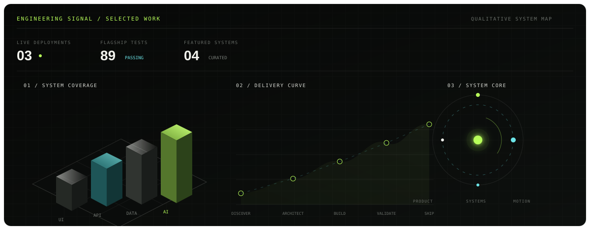
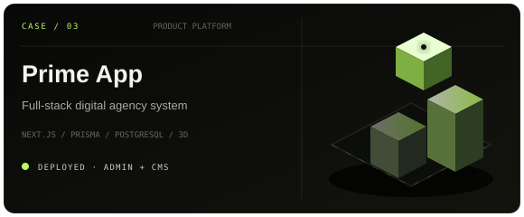
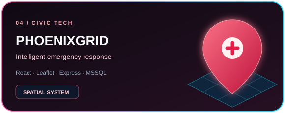

  

  <a href="mailto:masifnawaz815@gmail.com"><b>EMAIL</b></a>
  &nbsp;&nbsp;·&nbsp;&nbsp;
  <a href="https://www.linkedin.com/in/muhammad-asif-nawaz-"><b>LINKEDIN</b></a>
  &nbsp;&nbsp;·&nbsp;&nbsp;
  <a href="https://github.com/asifnawaz23?tab=repositories"><b>SYSTEM INDEX</b></a>

 

## Profile

Software engineer working across **AI-enabled products, full-stack systems, and interactive web experiences**. I move between product architecture, interface engineering, APIs, data, testing, and deployment—turning ambiguous ideas into software that is clear to use and straightforward to inspect.

Currently completing a Software Engineering degree at **Sir Syed University of Engineering & Technology**, with a practical focus on explainable AI, resilient application flows, and motion that serves the product rather than distracting from it.

  

Signals shown above are grounded in the featured repositories: three verified live deployments, 89 tests in the flagship system, and four curated case studies. The capability chart is qualitative, not a vanity score.

 

## Selected systems

  
  

  
  

### 01 / ScamShield AI

An evidence-first scam intelligence system designed for Pakistan. It converts suspicious text, URLs, and screenshots into structured reports with traceable risk signals, English and Roman Urdu explanations, OCR, reputation checks, secure identity flows, and privacy-conscious history.

**Engineering signal:** deterministic analysis bound to explainable AI output; **89 automated tests** across detection, authentication, authorization, and reputation services.

`React` `TypeScript` `Node.js` `Turso` `Three.js` `AI Vision`

[Live system ↗](https://myscamshield-ai.netlify.app/) &nbsp;·&nbsp; [Repository ↗](https://github.com/asifnawaz23/ScamShield-AI)

### 02 / STREAMAI

A real-time, multi-model conversation interface that streams Gemini and OpenRouter responses token by token. The system combines server-side provider routing and key failover with local conversation history, Markdown rendering, responsive interaction design, and a live React Three Fiber hologram.

`Next.js 15` `React 19` `TypeScript` `Vercel AI SDK` `Three.js`

[Live system ↗](https://stream-ai-chat.vercel.app) &nbsp;·&nbsp; [Repository ↗](https://github.com/asifnawaz23/Stream-ai-ChatBot)

### 03 / Prime App

A deployed full-stack platform for a digital engineering studio. The application pairs a custom WebGL interface with inquiry workflows, protected administration, content management, PostgreSQL persistence, and serverless deployment.

`Next.js` `TypeScript` `Prisma` `PostgreSQL` `Three.js` `Vercel`

[Live system ↗](https://prime-app-xi.vercel.app) &nbsp;·&nbsp; [Repository ↗](https://github.com/asifnawaz23/PrimeApp)

### 04 / PhoenixGrid

An emergency-response platform connecting citizens, rescue operators, and command workflows through incident handling and Leaflet-based spatial mapping, supported by a Node/Express service layer and Microsoft SQL Server.

`React` `TypeScript` `Leaflet` `Node.js` `Express` `MSSQL`

[Repository ↗](https://github.com/asifnawaz23/PhoenixGrid)

 

## Engineering range

| Surface | Working set |
|:--|:--|
| **Product & interface** | React, Next.js, TypeScript, Tailwind CSS, Framer Motion, responsive systems |
| **Interactive 3D** | Three.js, React Three Fiber, WebGL scenes, procedural motion, graceful fallbacks |
| **Services** | Node.js, Express, Flask, REST APIs, authentication, serverless functions |
| **Data** | PostgreSQL, Prisma, Turso/libSQL, SQLite, Microsoft SQL Server |
| **Applied AI** | Gemini, OpenRouter, OCR/vision flows, streaming inference, evidence-first explanations |
| **Delivery** | Git, automated tests, Vercel, Netlify, environment and deployment design |

## Working principles

**Evidence over spectacle.** Intelligent features should show their reasoning, expose uncertainty, and fail honestly.

**Interface is part of the system.** Motion, hierarchy, accessibility, and responsiveness are engineering concerns—not decoration after the fact.

**A prototype should have a path forward.** I prefer clear architecture, documented constraints, testable behavior, and deployment-aware decisions from the beginning.

## Current thread

Recent work is centered on practical AI/ML experimentation in Python through the [`safex-ai-ml-internship`](https://github.com/asifnawaz23/safex-ai-ml-internship) lab, alongside continued refinement of explainable safety tooling and production-oriented web systems.

## Contact

For engineering, product, or research conversations:

[**masifnawaz815@gmail.com**](mailto:masifnawaz815@gmail.com) &nbsp;·&nbsp; [**LinkedIn**](https://www.linkedin.com/in/muhammad-asif-nawaz-) &nbsp;·&nbsp; [**GitHub**](https://github.com/asifnawaz23)

 

  Designed as a living systems portfolio by Muhammad Asif Nawaz.

