

  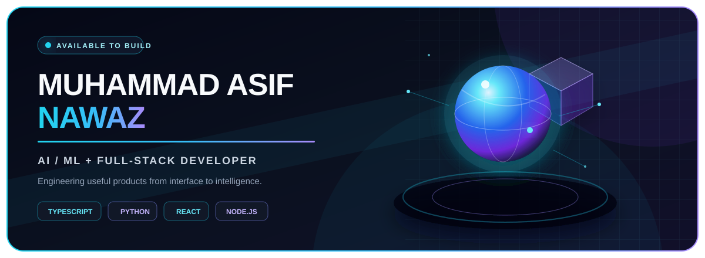

  <a href="mailto:masifnawaz815@gmail.com"><b>Email</b></a>
  &nbsp;·&nbsp;
  <a href="https://www.linkedin.com/in/muhammad-asif-nawaz-"><b>LinkedIn</b></a>
  &nbsp;·&nbsp;
  <a href="https://myscamshield-ai.netlify.app/"><b>Live: ScamShield AI</b></a>
  &nbsp;·&nbsp;
  <a href="https://stream-ai-chat.vercel.app"><b>Live: STREAMAI</b></a>

## Hi, I'm Asif

I'm a Software Engineering student at SSUET who builds full products: React and Next.js interfaces, Node and Python services, SQL data layers, and AI features that show how they reached a result. My recent work covers scam detection, NLP feedback analytics, live fleet tracking, and streaming LLM chat.

| | |
|:--|:--|
| **Focus** | Applied AI · full-stack web · real-time systems · interactive 3D |
| **Experience** | AI/ML Intern at **SafeX** · Front-End AI Engineering Intern at **FlyRank** |
| **Education** | BS Software Engineering, Sir Syed University of Engineering & Technology (in progress) |
| **Proof** | 3 live deployments · 100+ automated tests across ScamShield, DentalSense, and the vulnerability triage tool |

  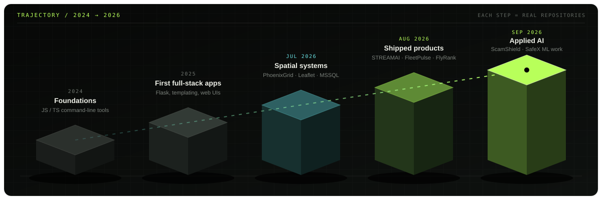

Each step maps to public repositories. Work moved from small CLI tools in 2024 to deployed, tested AI products in 2026.

## Experience

**AI/ML Intern · SafeX** &nbsp;2026

- Built **DentalSense AI**, a feedback analytics platform. It runs DistilBERT sentiment inference locally behind a FastAPI service, tags 9 operational themes with transparent rules, validates CSV batches, and shows trends in a React dashboard. Ships with a model card and a pytest suite.
- Built an **AI-assisted vulnerability triage tool**. It combines zero-shot classification (DeBERTa-v3 NLI) with a deterministic validation layer and outputs severity, explanation, and remediation as JSON reports. Passes 10 of 10 controlled scenarios.
- [Repository ↗](https://github.com/asifnawaz23/safex-ai-ml-internship)

**Front-End AI Engineering Intern · FlyRank** &nbsp;2026

- Implemented accessible **Modal, Tabs, and Disclosure** components from scratch, following the WAI-ARIA Authoring Practices: focus trapping and restoration, keyboard navigation, Escape handling, and no component-library dependencies.
- Wrote a technical gap analysis comparing these components with Radix UI / shadcn (portals, scroll lock, focus scopes, dismissable layers).
- [Repository ↗](https://github.com/asifnawaz23/Flyrank-AI-Internship)

## Featured projects

  <a href="#01--scamshield-ai">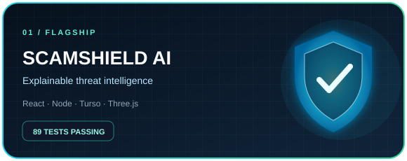</a>
  <a href="#02--dentalsense-ai">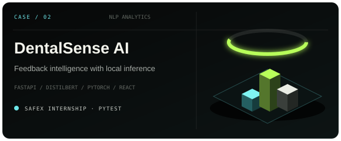</a>

  <a href="#03--fleetpulse"></a>
  <a href="#04--streamai">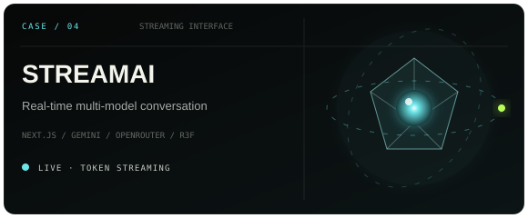</a>

### 01 · ScamShield AI

Scam and phishing analysis for Pakistan. You paste a message, link, or screenshot and get back a report that explains its verdict.

- **Problem:** Spam filters say "likely spam" and stop there. Users can't see why, and the filters guess even when there's little evidence.
- **Approach:** A deterministic signal engine scores the input first: 16 signal classes, Roman Urdu support, URL typosquat and homoglyph checks, and reputation APIs. The AI only explains that evidence. It never produces the verdict, and it returns "Unknown" when evidence is thin.
- **Proof:** 89 automated tests covering detection, IDOR protection, JWT and OAuth state handling, and email-verification token lifecycle. Deployed on Netlify with Turso.

`React` `TypeScript` `Node.js` `Express` `Turso` `Three.js` `Vision OCR`  &nbsp;→&nbsp; [Live ↗](https://myscamshield-ai.netlify.app/) · [Source ↗](https://github.com/asifnawaz23/ScamShield-AI)

<b>Architecture</b>

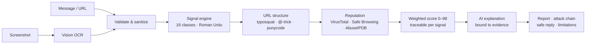

The score is computed before any model runs, so every number in the report traces back to a specific signal. The model only turns that evidence into plain language.

### 02 · DentalSense AI

Turns unstructured clinic feedback into sentiment, themes, and trends. Built during the SafeX internship.

- **Problem:** Clinics get feedback from many channels. Reading and tagging it by hand is slow and inconsistent, so recurring issues like long waits or pricing confusion get missed.
- **Approach:** Sentiment comes from a real transformer (DistilBERT SST-2) running locally on CPU. Themes come from explainable rules instead of a second black-box model. Generated insights are limited to claims backed by computed statistics.
- **Proof:** pytest suite, model card, architecture docs. Uses synthetic data only and makes no clinical claims.

`Python` `FastAPI` `Hugging Face Transformers` `PyTorch` `React`  &nbsp;→&nbsp; [Source ↗](https://github.com/asifnawaz23/safex-ai-ml-internship/tree/main/WEEK%203/DentalSense-AI)

<b>Architecture</b>

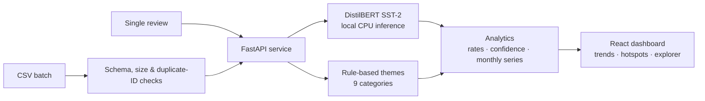

Sentiment uses the model because it handles nuance. Themes use rules because a clinic manager needs to know exactly why a review was tagged "Pricing".

### 03 · FleetPulse

Real-time fleet management: live vehicle tracking, trips, fuel, maintenance, and alerts, with separate admin and driver portals.

- **Problem:** A dispatcher needs to see vehicle positions and problems as they happen, not after a page refresh.
- **Approach:** A telemetry simulator emits GPS updates every 4 seconds on 5 Karachi routes. Socket.IO broadcasts them to every connected dashboard, where MapLibre renders live markers. The server raises alerts for speeding, low fuel, harsh braking, and geofence violations.
- **Proof:** TypeScript end to end, JWT role-based auth (ADMIN / DRIVER), bcrypt password hashing, express-validator on every mutation endpoint, and trip replay with timeline scrubbing.

`React 19` `TypeScript` `Node.js` `Express` `Socket.IO` `MapLibre GL` `SQLite`  &nbsp;→&nbsp; [Source ↗](https://github.com/asifnawaz23/-Decodelabs/tree/main/week%203%20proj)

<b>Architecture</b>

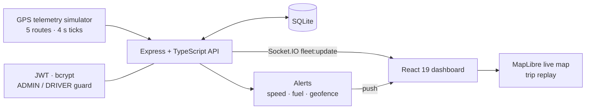

Telemetry is pushed over WebSockets instead of polled, so one server tick updates every open dashboard at once.

### 04 · STREAMAI

Streaming chat across multiple AI models, with a live 3D hologram in the interface.

- **Problem:** Waiting for a full model response feels slow, and a single expired API key takes the whole app offline.
- **Approach:** Tokens stream to the UI as they're generated, through a Next.js route handler that runs only on the server. If a provider key is invalid or out of quota, the handler retries with the next key. Users can switch between Gemini and OpenRouter (Nemotron).
- **Proof:** Strict TypeScript with no `any`. API keys never reach the client bundle. Deployed on Vercel.

`Next.js 15` `React 19` `TypeScript` `Vercel AI SDK` `React Three Fiber`  &nbsp;→&nbsp; [Live ↗](https://stream-ai-chat.vercel.app) · [Source ↗](https://github.com/asifnawaz23/Stream-ai-ChatBot)

<b>Request flow</b>

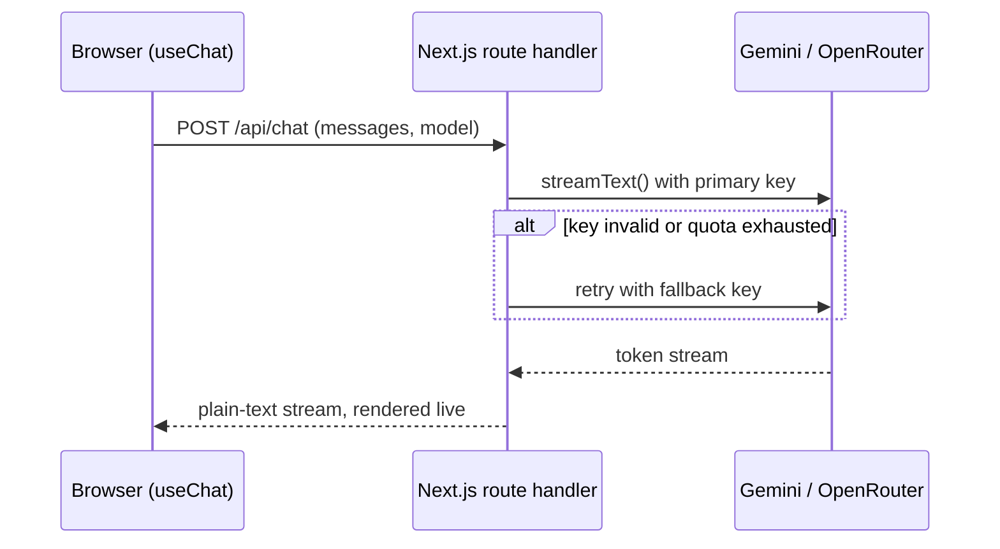

### More work

| Project | What it shows | Stack |
|:--|:--|:--|
| [**Nexora Inventory**](https://github.com/asifnawaz23/-Decodelabs/tree/main/Week%202%20proj) | Full-stack inventory system. Every UI action calls a real Express REST API with server-side validation. Includes analytics views and a 3D dashboard scene. | React · Vite · Express · R3F |
| [**Prime App**](https://github.com/asifnawaz23/PrimeApp) | Deployed Next.js platform with a WebGL hero, JWT-protected admin CMS, and Prisma/PostgreSQL persistence. | Next.js · Prisma · PostgreSQL · Three.js |
| [**PhoenixGrid**](https://github.com/asifnawaz23/PhoenixGrid) | Emergency-response platform with Leaflet incident mapping, an Express API, and Microsoft SQL Server. | React · Leaflet · Express · MSSQL |

## Skills, with evidence

Every skill below links to at least one project where it was used.

| Skill | ScamShield | DentalSense | FleetPulse | STREAMAI | Vuln. triage |
|:--|:-:|:-:|:-:|:-:|:-:|
| TypeScript / React | ● | ● | ● | ● | |
| Node.js / Express | ● | | ● | | |
| Python / FastAPI | | ● | | | ● |
| ML models (Transformers, PyTorch) | | ● | | | ● |
| LLM integration | ● | | | ● | |
| Real-time (WebSockets, streaming) | | | ● | ● | |
| Auth & security (JWT, OAuth, bcrypt) | ● | | ● | | |
| SQL databases | ● | | ● | | |
| Automated testing | ● | ● | | | ● |
| 3D / WebGL | ● | | | ● | |

  

Generated from the GitHub API by <a href="./scripts/generate-stats.mjs"><code>scripts/generate-stats.mjs</code></a> and refreshed every week by GitHub Actions. Markup, styles, notebooks, and repositories with committed dependency folders are excluded, so the chart reflects code I wrote.

## How I work

- **AI should show its evidence.** Scores trace back to signals, uncertainty is stated openly, and the system returns "Unknown" instead of guessing.
- **Security is part of the first version.** Ownership checks, server-only secrets, and input validation go in from the start.
- **The interface is engineering work.** Accessibility, keyboard support, and real-time feedback get the same care as the API.

## Contact

[masifnawaz815@gmail.com](mailto:masifnawaz815@gmail.com) · [LinkedIn](https://www.linkedin.com/in/muhammad-asif-nawaz-) · [GitHub](https://github.com/asifnawaz23)
